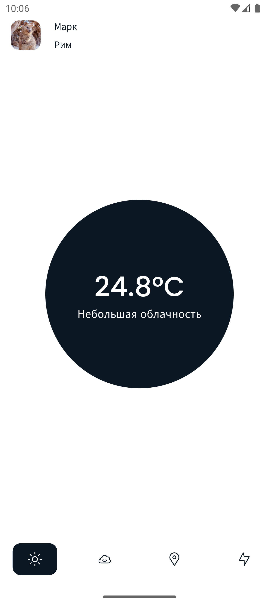
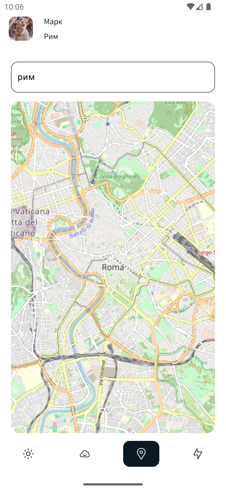

# Открой мир вокруг!

Мобильное приложение для iOS и Android, показывающее погоду и новости в выбранном городе

## Реализованный функционал
* авторизация с локальным сохранением пользователя
* получение текущей погоды в выбранном городе (с сохранением)
* возможность автоматического выбора города по местоположению пользователя

## Перед запуском

Необходимо запустить следующую команду:
```
dart run build_runner build --delete-conflicting-outputs
```

## Авторизация

Пользователь 1:
* логин: kris
* пароль: 123

Пользователь 2:
* логин: mark
* пароль: 123

## Скриншоты приложения

#### Экран авторизации


#### Погода


#### Выбор города


### В ближайшем будущем
* новости в выбранном регионе
* выбор местоположения на карте
* локализация
* раздел "Мои города"
* тёмная тема
* рекомендации в зависимости от погоды